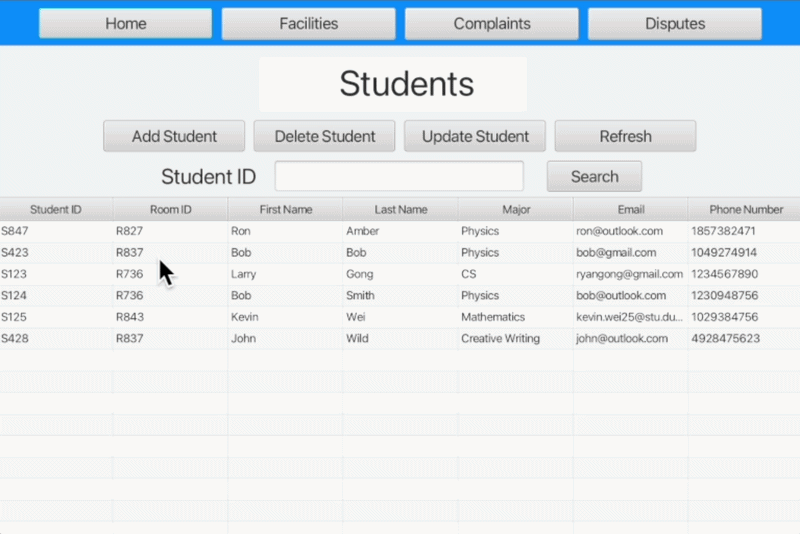

# 🏢 RA Task Manager App (Java + MySQL)

A full-stack **RA Task Manager App** designed to help Resident Assistants (RAs) in universities efficiently manage students, facilities, complaints, and disputes within a university dormitory.

---

## 📌 Overview

The goal for this project was for me to learn more about the process of full-stack development. I tried creating something that has real-world relevance, and since I know a few people who are RAs, I decided to create a task manager for them. 

The application provides an intuitive **graphical user interface (GUI)** built with **JavaFX**, backed by a local **MySQL database**.

---

## 🚀 Features

### 👨‍🎓 Student Management
- Add, remove, and update student records  
- Store key details (ID, room, major, contact info)  
- Search and display full student information  

### 🏢 Facility Management
- Track dorm facilities (e.g., AC units, study rooms)  
- Monitor and update maintenance status  

### ⚠️ Complaints & Disputes
- Log student complaints and disputes  
- Assign urgency levels  
- Prioritize and display most urgent issues  

### 🏠 Home Dashboard
- View:
  - Urgent complaints/disputes  
  - Facilities requiring maintenance  
  - Reminders  

### 🔔 Reminder System
- Add and remove reminders for important tasks  

### ❗ Error Handling
- Input validation with clear, user-friendly error messages  

---

## 🧠 Tech Stack

| Technology | Purpose |
|----------|--------|
| **Java** | Core programming language |
| **JavaFX** | GUI development |
| **MySQL** | Database management |
| **JDBC** | Database connectivity |

---

## 🏗️ System Design

### Object-Oriented Structure
The system is built using OOP principles:
- Classes represent real-world entities:
  - Students  
  - Facilities  
  - Complaints  
  - Disputes  
  - Reminders  

### Database Schema
Key tables include:
- `Students`
- `Facilities`
- `Complaints`
- `Disputes`
- `Reminders`

Each table uses structured fields such as IDs, descriptions, urgency levels, and status indicators.

---

## 🖥️ User Interface

The application uses a **JavaFX GUI** designed for ease of use:

- Home Page Dashboard  
- Students Management Page  
- Facilities Page  
- Complaints/Disputes Page  
- Insert/Update Forms  

---

## 💡 What I Learned

Through this project, I developed both technical and problem-solving skills:

### 💻 Programming & Software Design
- Applied **object-oriented programming (OOP)** concepts to model real-world systems  
- Learned how to structure large programs into modular, maintainable components  
- Improved debugging and testing strategies  

### 🗄️ Database Management
- Designed and implemented a **relational database schema** in MySQL  
- Learned how to connect Java applications to databases using **JDBC**  
- Gained experience with CRUD operations and data validation  

### 🎨 User Interface Development
- Built a full GUI using **JavaFX**  
- Focused on usability and intuitive design  
- Learned how frontend design impacts user experience  

### 🧠 Problem Solving
- Translated real-world requirements into technical solutions  
- Handled edge cases and invalid inputs effectively  
- Implemented sorting and data organization techniques  

### 📈 Project Development
- Planned and designed a system before implementation  
- Created diagrams (UML, flowcharts) to guide development  
- Understood the importance of testing and iteration  

---

## 🔮 Future Improvements

- Add user authentication (login system)  
- Implement role-based access (Admin vs RA)  
- Cloud database integration  
- Mobile-friendly version  
- Real-time notifications  

---

## 📷 Demo

